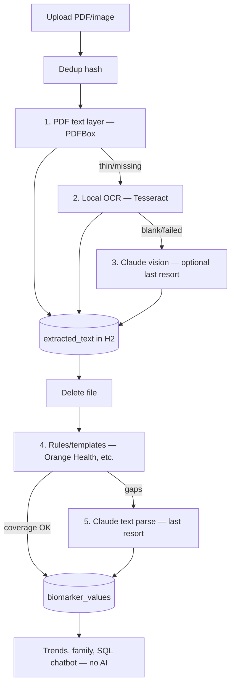

# Engineering Principles

**Read this first.** Every design and implementation decision in PHI should align with these principles.

_Last updated: 2026-09-18_

---

## What PHI is

**Personal Health Intelligence** is an **engineered health data platform** for families:

- Structured lab history over time
- Trends, comparisons, out-of-range detection
- Family context with access control
- Privacy-first, self-hostable infrastructure

**Primary users:** elderly family members in villages and small towns — paper lab slips, phone photos, CamScanner/Adobe Scan PDFs. Fancy digital reports (Orange Health, etc.) are a minority segment, not the design center.

## What PHI is not

| PHI is **not** | Why |
|----------------|-----|
| A ChatGPT / Gemini chat wrapper | Generic chat already reads PDFs once — no moat |
| A PDF dumping ground | Files are messy, expensive, hard to query |
| “Send everything to Claude and ask questions” | That burns tokens and ignores the database we built |
| A document storage app | PDFs are **inputs**, not the system of record |

**If a feature can be answered with SQL over `biomarker_values`, it must not call Claude.**

---

## North star

```
Messy ingest (PDF/image)  →  structured rows in DB  →  engineered product (trends, family, insights)
                                    ↑
                         Claude used sparingly here only
                         (unstructured text → JSON, once per report)
```

The **database is always the source of truth.** Everything the app shows — UI, dashboards, future chatbot — reads **tabular biomarker and timeline data**, not raw PDFs.

---

## Data sovereignty

| Layer | Role |
|-------|------|
| **H2** (`biomarker_values`, `lab_reports`, …) | Source of truth for app features |
| **DuckDB** | Analytics read model (trends, compare, dashboards) |
| **PDF / image** | Ephemeral ingest artifact — extract text, then discard |
| **`extracted_text` (CLOB)** | Checkpoint between local extract and optional Claude parse |
| **Claude API** | One-time parser at the ingest boundary — not the app brain |

See [19-product-decisions.md](./19-product-decisions.md) (Data sovereignty) for locked decisions.

---

## Staged ingest pipeline

Upload follows a **strict waterfall** — AI is **always last**, never first:



| Step | Method | Claude / AI? |
|------|--------|--------------|
| **1** | PDF text layer (digital PDFs) | **No** |
| **2** | Tesseract OCR (scans, photos) | **No** |
| **3** | Claude vision on image (only if 1–2 fail) | **Yes — last resort** (`PHI_CLAUDE_VISION_FALLBACK`) |
| **4** | Rules / regex templates | **No** |
| **5** | Claude parse text → biomarkers (only if rules insufficient) | **Yes — last resort** |

Config:
- `PHI_CLAUDE_AUTO_PARSE` — auto-run step 5 when rules fail (default `true`; `false` in dev)
- `PHI_CLAUDE_VISION_FALLBACK` — enable step 3 (default `false`; opt-in when OCR fails)
- `PHI_CLAUDE_MIN_COVERAGE` — skip step 5 when rules coverage is high enough

Manual trigger: `POST /api/v1/reports/{id}/parse`

---

## When to use Claude (last resort only)

**Rule:** If PDF text, OCR, or rules can do the job, **do not call Claude.**

### Do use Claude (narrow, last)

| Use case | When | Frequency |
|----------|------|-----------|
| Vision text extraction | Local PDF/OCR returned **blank** and `PHI_CLAUDE_VISION_FALLBACK=true` | **Once per report, only if needed** |
| Lab text → structured biomarker JSON | Rules coverage below `PHI_CLAUDE_MIN_COVERAGE` | **Once per unique report** |
| Normalize unknown test names | Rules/aliases failed | Fallback only |

### Do not use Claude

| Use case | Use instead |
|----------|-------------|
| Trends (“Vitamin D over 5 years”) | DuckDB / SQL |
| Out-of-range flags | Compare value vs `reference_range` in DB |
| Family comparison | Join by `person_id` + date |
| List / filter reports | `lab_reports` queries |
| Duplicate detection | Content hash at upload |
| Retry after failure | Re-parse from `extracted_text` in DB |
| Chat: “Is my HbA1c improving?” | SQL tool → small JSON context → optional short NL summary |

### Future chatbot (correct design)

**Not:** paste full PDF or full history into every prompt.

**Yes:** tool-calling over structured data:

```
User: "Is my Vitamin D improving?"
  → app: SELECT value, report_date FROM biomarker_values WHERE canonical_name = 'vitamin_d' ...
  → chatbot gets ~10 rows JSON + optional one short explanation
```

---

## Token discipline

1. **Never send PDF bytes to Claude** — only extracted plain text (already local).
2. **Save text to DB before any API call** — checkpoint, cheap retries.
3. **Dedup uploads** — same file hash per person = `409`, no second parse.
4. **Never re-parse `COMPLETED` reports** unless user explicitly retries.
5. **Rules-first extraction (planned)** — known lab templates via regex; Claude only for gaps.
6. **Dev: `PHI_CLAUDE_AUTO_PARSE=false`** — build UI without burning credits.

---

## Engineering vs “easy”

| Easy (avoid as default) | Engineered (our path) |
|-------------------------|------------------------|
| Dump PDF to Claude on every question | Query DB, cite report #42 on 2026-09-06 |
| Store PDFs forever | Ephemeral files; structured rows persist |
| One async job: extract + Claude + pray | Staged pipeline with statuses and checkpoints |
| Chat as the product | Structured memory + analytics as the product |
| Re-upload on failure | Retry from `extracted_text` |

---

## Review checklist (for every PR / feature)

Before merging or shipping, ask:

1. Does this read from **structured DB data** or dump documents to Claude?
2. If Claude is called, is it **once at ingest** or justified as a narrow fallback?
3. Is the PDF/file **ephemeral** — deleted after local text is saved?
4. Can this work **offline from H2/DuckDB** without an API key?
5. Would ChatGPT already do this equally well? If yes, we’re not adding value.

---

## Related docs

| Doc | Topic |
|-----|-------|
| [01-project-overview.md](./01-project-overview.md) | Mission and stack |
| [03-data-flow.md](./03-data-flow.md) | Upload → extract → parse sequences |
| [07-extraction-pipeline.md](./07-extraction-pipeline.md) | Phase 1 + Phase 2 deep dive |
| [17-hybrid-data-architecture.md](./17-hybrid-data-architecture.md) | H2 + DuckDB |
| [19-product-decisions.md](./19-product-decisions.md) | Locked product decisions |
