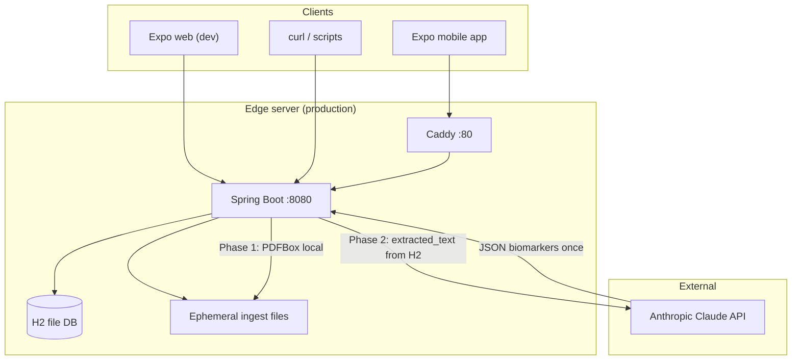
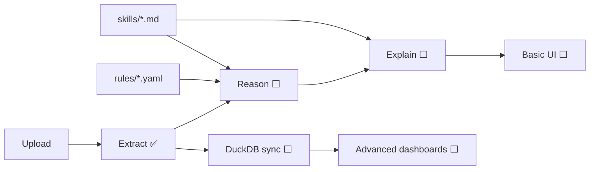

# System Architecture

**North star:** [00-engineering-principles.md](./00-engineering-principles.md) — database is source of truth; Claude at ingest boundary only.

## High-level diagram



## Component responsibilities

| Component | Responsibility |
|-----------|----------------|
| **Mobile app** | File picker, multipart upload, status polling, biomarker display |
| **ReportController** | HTTP entry for uploads |
| **ReportIngestionService** | Dedup hash, save ephemeral file, create DB row |
| **ReportFileStorageService** | Hash, purge PDF after local extract, retention job |
| **ReportExtractionService** | Staged pipeline: local text → DB → optional Claude |
| **PdfTextExtractor** | PDFBox text extraction (Phase 1, local, free) |
| **ClaudeExtractionClient** | Phase 2 only — text from H2 → Anthropic API |
| **ClaudeResponseParser** | Parse Claude JSON from response body |
| **BiomarkerNormalizer** | Map test names to canonical snake_case IDs |
| **ReportQueryController** | Read report status and biomarkers |
| **H2** | **Source of truth** — persons, reports, extracted_text, biomarker values |
| **DuckDB** | Analytics replica — trends, compare (synced from H2) |
| **Caddy** | TLS + reverse proxy (production) |

## Backend package structure

```
com.phi/
├── PhiApplication.java          @SpringBootApplication + @EnableConfigurationProperties
├── api/                         REST controllers (HTTP boundary)
│   ├── HealthController
│   ├── ReportController
│   └── ReportQueryController
├── ingestion/                   File upload + dedup
│   ├── ReportIngestionService
│   └── DuplicateReportException
├── storage/                     Ephemeral file lifecycle
│   ├── ReportFileStorageService
│   └── ReportFileRetentionScheduler
├── extraction/                  Staged: local text → DB → Claude
│   ├── ReportExtractionService
│   ├── PdfTextExtractor
│   ├── ClaudeExtractionClient
│   ├── ClaudeResponseParser
│   ├── BiomarkerNormalizer
│   └── ClaudeBiomarkerDto
├── reasoning/                   Placeholder (Phase 3)
│   └── ReasoningModule
├── domain/                      JPA entities + repositories
│   ├── Person, LabReport, BiomarkerValue
│   ├── ExtractionStatus (enum)
│   └── *Repository interfaces
└── config/
    ├── PhiProperties            @ConfigurationProperties("phi")
    ├── AsyncConfig              Thread pool for extraction
    ├── WebConfig                CORS
    └── SecurityConfig           Spring Security filter chain
```

## Layered architecture

```
┌─────────────────────────────────────────┐
│  Presentation (mobile / HTTP clients)    │
├─────────────────────────────────────────┤
│  API layer (controllers)                 │
├─────────────────────────────────────────┤
│  Application services                    │
│  ingestion · extraction · (reasoning)    │
├─────────────────────────────────────────┤
│  Domain + persistence (JPA / Flyway)   │
├─────────────────────────────────────────┤
│  Infrastructure                          │
│  filesystem · H2 · Claude HTTP client    │
└─────────────────────────────────────────┘
```

## Threading model

| Thread | Work |
|--------|------|
| HTTP worker (`nio-8080-exec-*`) | Handle upload, health, poll requests |
| Async worker (`phi-extract-*`) | Phase 1 local extract + Phase 2 Claude parse |

`AsyncConfig` configures a pool of 2–4 threads with prefix `phi-extract-`.

**Phase 1** (`extractAndPersistLocalText`) is transactional — text saved to H2, PDF purged.  
**Phase 2** (`runClaudeParsing`) reads text from DB; Claude HTTP call does **not** hold a DB transaction open.

## Data stores

| Store | Content | Mutable? |
|-------|---------|----------|
| H2 `persons` | Family member records | Yes |
| H2 `lab_reports` | Metadata + `extracted_text` + extraction status | Yes |
| H2 `biomarker_values` | Parsed test results per report | Replaced on re-parse |
| DuckDB `analytics.duckdb` | Trend/compare fact tables | Synced from H2 |
| Filesystem `reports/` | Ephemeral ingest files | **Deleted after Phase 1** (default) |

## Planned architecture (Phase 3+)

**Product:** One app, equal family peers, [basic vs advanced mode](./16-product-vision-family-and-modes.md).  
**Data:** [H2 + DuckDB hybrid](./17-hybrid-data-architecture.md) for dashboards.



- **Reason:** deterministic evaluation (e.g. `lp_a > 30` → high severity)
- **Explain:** short NL from SQL findings (not full PDF dumps to Claude)
- **Present:** basic = own summary + trends; advanced = family + dashboards
- **DuckDB:** analytics replica synced from H2 after extraction

## Deployment topologies

### Local development

```
Phone (Expo Go) ──WiFi──► Fedora PC :8080 (Spring Boot)
                              ├── H2 ~/.phi/h2db
                              └── Ephemeral ~/.phi/reports (purged after extract)
```

### Production (edge-server)

```
Phone ──► Caddy :80 ──► Spring Boot :8080
                            ├── H2 /var/phi/data/phi.mv.db
                            └── Ephemeral /var/phi/reports/
```

Claude API is always reached over the internet from the backend — never from the phone directly.

## Non-goals

- ChatGPT-style “dump PDF and ask anything” product
- Long-term PDF archive
- Claude on every read/query path
- Multi-tenant SaaS at hyperscale
- Real-time streaming of extraction progress (polling only)
- Microservices / separate extraction worker process
- Cloud-hosted OLTP database
