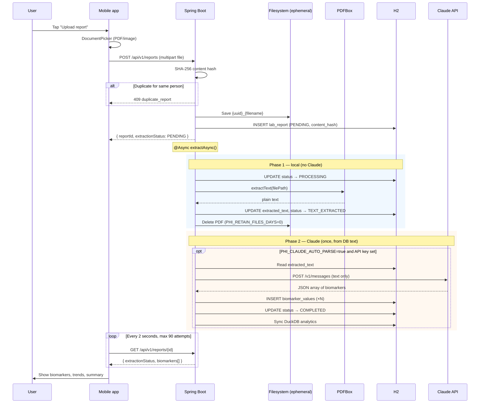
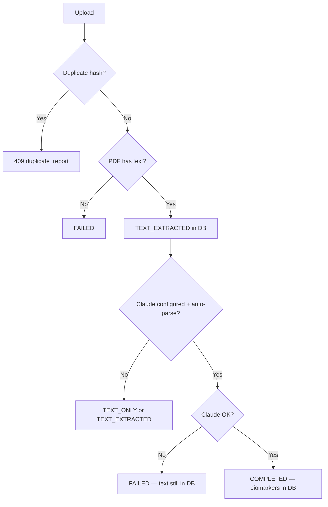

# Data Flow

Staged ingest: **local extract → save to DB → optional Claude parse**. The database is always the checkpoint.

See [00-engineering-principles.md](./00-engineering-principles.md) for why.

---

## End-to-end upload and extraction

---

## Upload path

### 1. Mobile → API

- **Endpoint:** `POST /api/v1/reports`
- **Body:** `multipart/form-data`, field name `file`
- **Query:** optional `personId`, `familyId`
- **Auth:** JWT Bearer token

### 2. Ingestion (`ReportIngestionService`)

| Step | Action |
|------|--------|
| 1 | Reject empty files |
| 2 | Resolve person + family ACL |
| 3 | Save file to `phi.storage.reports-dir` |
| 4 | Compute SHA-256 `content_hash` |
| 5 | If duplicate hash for same person → `409 duplicate_report`, delete temp file |
| 6 | Insert `LabReport` (`PENDING`, `content_hash`, `storage_path`) |
| 7 | Audit log: `report.uploaded` |

### 3. Async kickoff

`ReportController` calls `extractionService.extractAsync(reportId)` and returns immediately.

---

## Phase 1: Local text extraction

**Method:** `ReportExtractionService.extractAndPersistLocalText()`

| Step | Action |
|------|--------|
| 1 | `markProcessing()` |
| 2 | If PDF → `PdfTextExtractor.extractText()` |
| 3 | If non-PDF → placeholder (OCR not implemented) |
| 4 | If text blank → `markFailed()`, stop |
| 5 | `markTextExtracted(text)` — **text persisted in H2 before any Claude call** |
| 6 | `purgeAfterExtractionIfDue()` — delete PDF when `PHI_RETAIN_FILES_DAYS=0` |

**Status after Phase 1:** `TEXT_EXTRACTED`

---

## Phase 2: Claude biomarker parsing

**Only if:** `CLAUDE_API_KEY` set **and** `PHI_CLAUDE_AUTO_PARSE=true` (default)

**Method:** `ReportExtractionService.runClaudeParsing()` (async)

| Step | Action |
|------|--------|
| 1 | Read `extracted_text` **from H2** (not from disk) |
| 2 | Truncate to 50,000 chars, call Claude Messages API |
| 3 | Parse JSON → `List<ClaudeBiomarkerDto>` |
| 4 | `completeExtraction()` — save `biomarker_values`, `COMPLETED` |
| 5 | `AnalyticsSyncService.syncReport()` → DuckDB |

**Manual trigger:** `POST /api/v1/reports/{id}/parse` (when auto-parse off or re-parse)

**Retry:** `POST /api/v1/reports/{id}/retry` — if `extracted_text` exists, Phase 2 only; else full pipeline

---

## Extraction statuses

| Status | Meaning | Claude called? |
|--------|---------|----------------|
| `PENDING` | Uploaded, not started | No |
| `PROCESSING` | Local extract or Claude in progress | Maybe |
| `TEXT_EXTRACTED` | Text in DB; PDF purged; parse not started or waiting | No |
| `COMPLETED` | Biomarkers in `biomarker_values` | Yes (once) |
| `TEXT_ONLY` | Text in DB; no API key | No |
| `FAILED` | Error in `extraction_error` | Maybe (if failed during Phase 2) |

---

## Polling path (mobile)

`pollReportUntilDone()` calls `GET /api/v1/reports/{id}` until:

| Status | Mobile behavior |
|--------|-----------------|
| `PENDING` / `PROCESSING` / `TEXT_EXTRACTED` | Keep polling (or timeout → show text-saved message) |
| `COMPLETED` | Show biomarkers |
| `TEXT_ONLY` | Show message (no API key) |
| `FAILED` | Throw error with `extractionError` |

Default: 90 attempts × 2 seconds = **3 minutes** max wait.

---

## Failure flows

On Phase 2 failure, `extracted_text` remains in H2 — retry does not need the PDF.

---

## Read paths (no Claude)

| Endpoint | Data source |
|----------|-------------|
| `GET /api/v1/reports/{id}` | H2 `lab_reports` + `biomarker_values` |
| `GET /api/v1/reports` | H2 list |
| `GET /api/v1/analytics/trends` | DuckDB |
| `GET /api/v1/analytics/compare` | DuckDB |
| `GET /api/v1/family/feed` | H2 |

**None of these call Claude.**

---

## Data sent to Claude

| Sent | Not sent |
|------|----------|
| `extracted_text` from H2 (plain text, truncated) | PDF/image bytes |
| System prompt for biomarker JSON | Other users' reports |
| | Full biomarker history |
| | Rules/skills (not integrated as dumps) |

---

## Future data flows (engineered)

1. **Rules-first extract:** regex/templates before Claude; Claude fills gaps only
2. **Reasoning:** `biomarker_values` → `rules/*.yaml` → deterministic findings (no LLM)
3. **Insights:** SQL/DuckDB aggregates → UI cards (no LLM)
4. **Chatbot:** user question → SQL tools → small JSON context → optional short NL (not full PDF dump)
