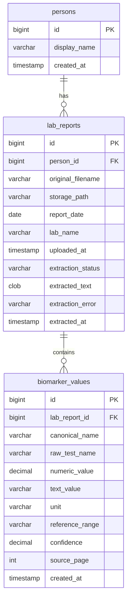

# Database Schema

**Engine:** H2 (embedded, file-based)  
**ORM:** Spring Data JPA + Hibernate  
**Migrations:** Flyway (`backend/src/main/resources/db/migration/`)  
**DDL mode:** `validate` (Hibernate never auto-creates tables)

---

## Entity relationship diagram



---

## Migrations

### V1 — `V1__initial_schema.sql`

Creates `persons` and `lab_reports` with portable SQL (H2 + PostgreSQL-compatible types).

### V2 — `V2__seed_default_person.sql`

```sql
INSERT INTO persons (display_name) VALUES ('Ankit');
```

### V3 — `V3__extraction_schema.sql`

Adds extraction columns to `lab_reports` and creates `biomarker_values`.

---

## Table: `persons`

| Column | Type | Constraints |
|--------|------|-------------|
| `id` | BIGINT | PK, auto-increment |
| `display_name` | VARCHAR(255) | NOT NULL |
| `created_at` | TIMESTAMP | NOT NULL, default `CURRENT_TIMESTAMP` |

**JPA:** `Person` (`com.phi.domain.Person`)

---

## Table: `lab_reports`

| Column | Type | Constraints |
|--------|------|-------------|
| `id` | BIGINT | PK |
| `person_id` | BIGINT | NOT NULL, FK → `persons(id)` |
| `original_filename` | VARCHAR(512) | NOT NULL |
| `storage_path` | VARCHAR(1024) | NOT NULL — absolute path on disk |
| `report_date` | DATE | Nullable — **not mapped in JPA entity** |
| `lab_name` | VARCHAR(255) | Nullable — **not mapped in JPA entity** |
| `uploaded_at` | TIMESTAMP | NOT NULL |
| `extraction_status` | VARCHAR(32) | NOT NULL, default `PENDING` |
| `extracted_text` | CLOB | Full PDF text after extraction |
| `extraction_error` | VARCHAR(1024) | Error message when failed |
| `extracted_at` | TIMESTAMP | When extraction finished |

**Index:** `idx_lab_reports_person_id`

**JPA:** `LabReport` — `@ManyToOne Person person`

**Status transitions** (via entity methods):

```
PENDING → PROCESSING → COMPLETED
                    → TEXT_ONLY
                    → FAILED
```

---

## Table: `biomarker_values`

| Column | Type | Description |
|--------|------|-------------|
| `id` | BIGINT | PK |
| `lab_report_id` | BIGINT | FK → `lab_reports(id)` |
| `canonical_name` | VARCHAR(128) | Normalized ID, e.g. `vitamin_d`, `alt` |
| `raw_test_name` | VARCHAR(255) | Name as printed on report |
| `numeric_value` | DECIMAL(14,4) | Parsed number |
| `text_value` | VARCHAR(255) | Non-numeric value |
| `unit` | VARCHAR(64) | e.g. `ng/mL`, `U/L` |
| `reference_range` | VARCHAR(128) | Lab reference as printed |
| `confidence` | DECIMAL(5,4) | 0.0000–1.0000 |
| `source_page` | INT | Page number if known |
| `created_at` | TIMESTAMP | Insert time |

**Index:** `idx_biomarker_values_report_id`

**JPA:** `BiomarkerValue` — `@ManyToOne LabReport labReport`

On re-extraction, all biomarkers for a report are deleted and re-inserted.

---

## Repositories

| Repository | Key methods |
|------------|-------------|
| `PersonRepository` | `findFirstByOrderByIdAsc()` |
| `LabReportRepository` | Standard JPA CRUD |
| `BiomarkerValueRepository` | `findByLabReportIdOrderByCanonicalNameAsc`, `deleteByLabReportId` |

---

## Connection strings

| Profile | JDBC URL | User |
|---------|----------|------|
| dev | `jdbc:h2:file:${user.home}/.phi/h2db;MODE=PostgreSQL;DB_CLOSE_DELAY=-1` | `sa` |
| prod | `jdbc:h2:file:/var/phi/data/phi;MODE=PostgreSQL;DB_CLOSE_DELAY=-1` | `phi` |
| test | `jdbc:h2:mem:phi` | `sa` (Flyway disabled, `ddl-auto: create-drop`) |

`MODE=PostgreSQL` enables PostgreSQL-compatible SQL syntax in H2.

---

## Known schema gaps

1. **`report_date` and `lab_name`** exist in V1 SQL but are not on the `LabReport` JPA entity — cannot be set via code today.
2. **No `findings` or `summaries` tables** — reasoning output not persisted yet.
3. **No user/auth tables** — single implicit person only.
