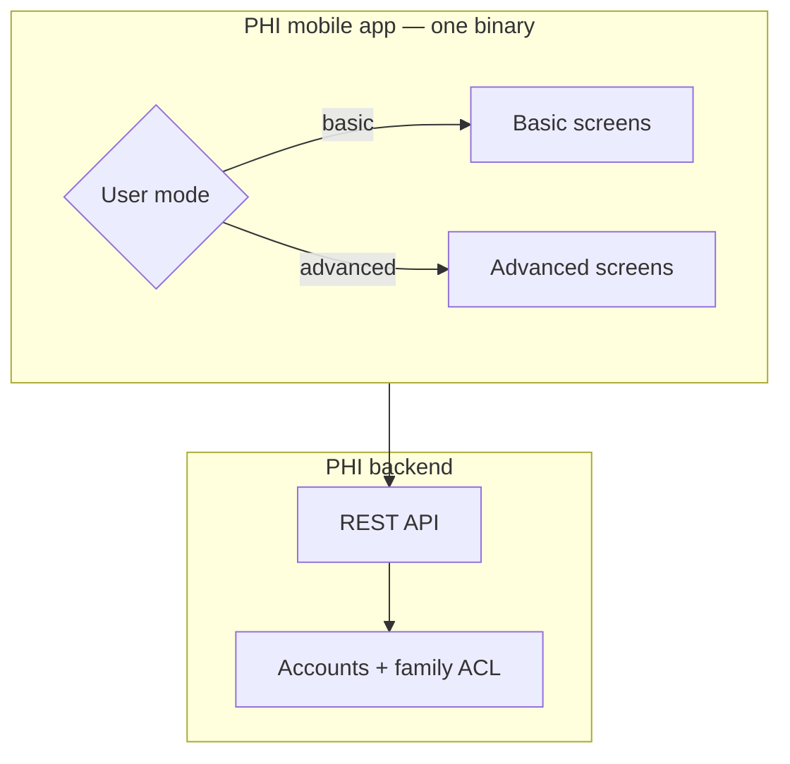
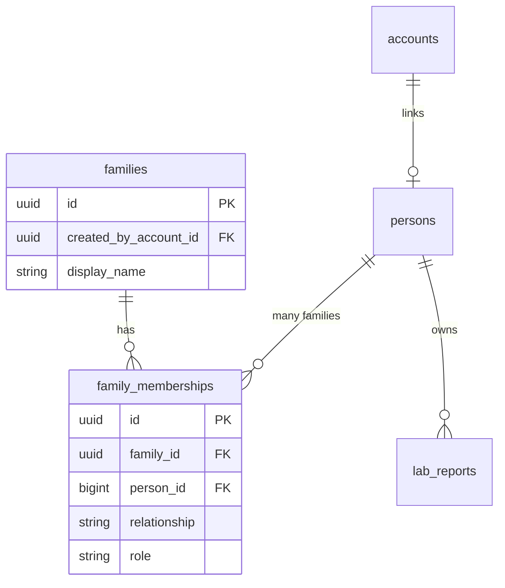

# Product Vision: Family Hub & User Modes

How PHI evolves from a single-user lab parser into a **family health hub** with one app for everyone.

_Last updated: 2026-09-17_

---

## Core idea

**One app. One account per person (when they need the app). One person can belong to multiple families.**

There is no caregiver app vs member app. **Advanced mode** unlocks full tools (upload for others, invites, dashboards). **Basic mode** is the default — simple language, family feed, own health summary.

| Term | Meaning |
|------|---------|
| **Family** | A group created by one person (creator = **admin**). Can delegate **maintainer**. |
| **Person** | A human profile — may exist **without** an account (kids, elders) |
| **Account** | Email + password login, strictly **one phone per account** |
| **Basic mode** | Default — own summary + simple family feed (“Mom’s report is ready”) |
| **Advanced mode** | Opt-in — manage families, upload for others, web/mobile dashboards |

**Multi-family:** Person 4 can be in Family A (created by A) and Family B (created by B). Each person can **create only one family** as owner, but join many via invite.

**Decentralized (product sense):** families link through shared members (graph of households), not one central “household owner” for the whole tree.

**Hosting:** one server, many families, data on **your local server**. See [19-product-decisions.md](./19-product-decisions.md).

---

## User modes

### Basic mode (default for new members)

Designed for older family members or anyone who wants simplicity.

| Can do | Cannot do (hidden) |
|--------|---------------------|
| See **own** latest report summary | Manage family settings / roles |
| See **own** trends (simple charts) | Upload PDF for someone else |
| See **own** action items (“talk to doctor about X”) | Full dashboards (web/mobile advanced) |
| **Family feed** — “Mom’s report is ready” (simple, readable) | Invite new members |
| Upload **own** lab PDF | Deep biomarker tables for others |
| Switch to advanced mode (simple toggle) | |
| Delete own wrong report | |

**UX principles:** large text, few screens, no jargon, one primary action (“Upload my report”).

### Advanced mode (opt-in)

Same person, same account — more screens and power.

| Capability | Description |
|------------|-------------|
| Family roster | View and edit all family members |
| Upload for others | Attach PDF to any person in the family |
| Invite members | Generate code; pre-fill relationship and basics |
| Family dashboards | Cross-member analytics (DuckDB-backed) |
| Full biomarker detail | All values, reference ranges, history |
| Rules & findings | Structured flags + AI explanations |

**Enabling advanced mode:** simple settings toggle (no PIN for v1).

---

## Single app architecture



The server enforces **what data you can access** (your family only). The client chooses **how much UI to show** (basic vs advanced). Advanced-only endpoints return 403 or simplified payloads for basic-mode clients if we enforce server-side too (recommended for upload-for-others).

---

## Family model (multi-family + roles)



### Rules

1. Every **account** links to exactly one **person**; **one phone per account**.
2. Every **person** can belong to **multiple families** (unique per family).
3. Each person can **create at most one family** as **admin** (owner).
4. **Roles per family:** `admin` (creator), `maintainer` (delegated), `member` (default).
5. **Profile without account** — kids/elders exist as `person` rows; advanced users manage their reports.
6. **Permissions** = UI mode + family role + membership (see [19-product-decisions.md](./19-product-decisions.md)).

### Permission matrix (summary)

| Action | Basic member | Advanced member | Admin / maintainer |
|--------|--------------|-----------------|-------------------|
| Read own reports | Yes | Yes | Yes |
| Family feed (“report ready”) | Yes | Yes | Yes |
| Read others’ full reports | No | Yes (in that family) | Yes |
| Upload for self | Yes | Yes | Yes |
| Upload for others | No | Yes | Yes |
| Invite / edit roster | No | No* | Yes |
| Delete wrong report | Own | Own + TBD | Yes |
| Web dashboards | No | Yes | Yes |

\*Unless maintainer role grants invite — detail in Phase 3a spec.

---

## Onboarding flows

### Flow A — First person (creates family)

1. Install app → sign up (email/phone + password or OTP).
2. Enter **own** profile: name, DOB, sex, optional height/weight.
3. Family auto-created (e.g. “Ankit’s family” — renameable).
4. Default **basic mode**; user can switch to advanced immediately.
5. Optional: invite spouse/parents from advanced screens.

### Flow B — Invited member

1. Advanced user adds person: name, relationship, DOB, sex, optional notes.
2. System creates `person` + pending **invite** with 6–8 character code (expires in 7 days).
3. Invitee installs app → “Join family” → enters code.
4. Confirms/edits profile → account linked to `person` → membership active.
5. Starts in **basic mode**.

### Flow C — Child / dependent without phone

1. Advanced user creates person profile only (no account).
2. All reports for that person managed by any advanced user in the family.
3. If they later get a phone, invite flow links their account.

---

## What basic users see after upload

```
┌─────────────────────────────────────┐
│  Hi Ankit                           │
│                                     │
│  ✓ Your Sep 2026 report is ready    │
│                                     │
│  In short:                          │
│  • Vitamin D is low                 │
│  • Lp(a) is high — talk to doctor   │
│  • Most other results look normal   │
│                                     │
│  [──── Vitamin D trend ────]        │
│                                     │
│  What to do:                        │
│  1. Discuss Lp(a) with your doctor  │
│  2. Retest vitamin D in 3 months    │
│                                     │
│  [ Upload new report ]              │
│                                     │
│  Settings → Switch to Advanced mode │
└─────────────────────────────────────┘
```

Advanced users get the same data plus family picker, full tables, and dashboards.

---

## Relation to current codebase

| Today | Target |
|-------|--------|
| Single seeded `Person` | Many persons per `family` |
| No auth | Accounts + sessions/JWT |
| `findFirstByOrderByIdAsc()` ingestion | Upload scoped to `person_id` + ACL |
| One home screen | Mode-aware navigation |
| H2 only | H2 + DuckDB (see [17-hybrid-data-architecture.md](./17-hybrid-data-architecture.md)) |

---

## Decisions log

All product answers: **[19-product-decisions.md](./19-product-decisions.md)**

---

## Related docs

- [17-hybrid-data-architecture.md](./17-hybrid-data-architecture.md) — H2 + DuckDB
- [18-family-api-and-schema-plan.md](./18-family-api-and-schema-plan.md) — tables, endpoints, phases
- [19-product-decisions.md](./19-product-decisions.md) — auth, multi-family, scale
- [../sprints/BACKLOG.md](../sprints/BACKLOG.md) — implementation backlog
