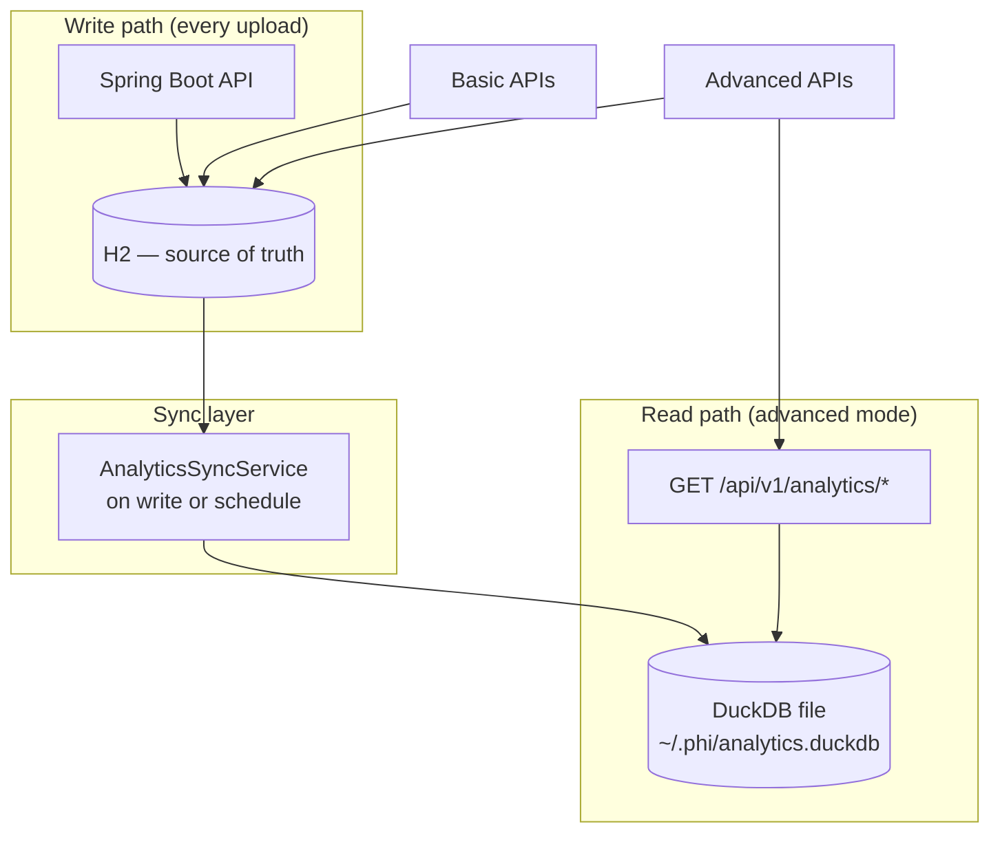

# Hybrid Data Architecture (H2 + DuckDB)

How transactional storage and analytics storage work together.

**Principle:** H2 and DuckDB are the product's memory. Claude is not. See [00-engineering-principles.md](./00-engineering-principles.md).

_Last updated: 2026-09-18_

---

## Why hybrid

| Workload | Best fit | Store |
|----------|----------|-------|
| Upload, save `extracted_text` + biomarkers, invites, auth | OLTP — many small writes | **H2** |
| “Vitamin D over last 5 reports for whole family” | OLAP — aggregations, trends | **DuckDB** |
| JPA entities, Flyway migrations, Spring transactions | Mature stack | **H2** |
| Dashboard widgets, export CSV, advanced SQL | Columnar analytics | **DuckDB** |

**Do not replace H2 with DuckDB** for the main app. Add DuckDB as a **read-optimized analytics replica**.

---

## Architecture diagram



---

## Data ownership

| Data | Primary store | Copy in DuckDB? |
|------|---------------|-----------------|
| accounts, families, invites | H2 only | No |
| persons, memberships | H2 only | Dimension table (sync) |
| lab_reports metadata | H2 | Yes |
| biomarker_values | H2 | Yes (fact table) |
| extraction status / errors | H2 only | No |
| PDF files on disk (ephemeral) | Filesystem | No — purged after Phase 1 local extract |
| `extracted_text` (CLOB) | H2 | No — ingest checkpoint, not analytics grain |

DuckDB holds **denormalized analytics tables** — safe to rebuild from H2 at any time.

---

## Proposed DuckDB schema (analytics)

```sql
-- Rebuilt from H2; not managed by JPA/Flyway

CREATE TABLE dim_person (
    person_id BIGINT PRIMARY KEY,
    family_id VARCHAR,
    display_name VARCHAR,
    sex VARCHAR,
    date_of_birth DATE
);

CREATE TABLE fact_biomarker (
    biomarker_id BIGINT PRIMARY KEY,
    person_id BIGINT,
    lab_report_id BIGINT,
    report_date DATE,
    canonical_name VARCHAR,
    numeric_value DOUBLE,
    text_value VARCHAR,
    unit VARCHAR,
    reference_range VARCHAR,
    uploaded_at TIMESTAMP
);

CREATE INDEX idx_fact_person_canonical ON fact_biomarker (person_id, canonical_name, report_date);
```

### Example analytics queries (advanced dashboards)

```sql
-- Trend: vitamin D for one person
SELECT report_date, numeric_value, unit
FROM fact_biomarker
WHERE person_id = ? AND canonical_name = 'vitamin_d'
ORDER BY report_date;

-- Family summary: out-of-range count per person (last report)
-- (reference parsing is app-specific; rules engine may pre-compute flags)

-- Compare members: average LDL last 12 months
SELECT p.display_name, AVG(f.numeric_value) AS avg_ldl
FROM fact_biomarker f
JOIN dim_person p ON p.person_id = f.person_id
WHERE f.canonical_name = 'ldl'
  AND f.report_date >= CURRENT_DATE - INTERVAL 12 MONTH
GROUP BY p.display_name;
```

---

## Sync strategies

| Strategy | When | Pros | Cons |
|----------|------|------|------|
| **On write** | After each `COMPLETED` extraction | Dashboards always fresh | Slight upload latency |
| **Scheduled** | Every 5 min / nightly cron | Simple, fast uploads | Stale dashboards briefly |
| **On demand** | First advanced dashboard load | No background work | Slow first open |

**Recommended for PHI:** **on write** for single-family scale (tiny data). Fallback full rebuild:

```bash
# Pseudocode endpoint or admin job
POST /api/v1/analytics/rebuild
```

---

## Spring Boot integration (planned)

```
com.phi.analytics/
├── DuckDbConfig.java           # JDBC to duckdb file
├── AnalyticsSyncService.java   # H2 → DuckDB upsert after extraction
├── AnalyticsQueryService.java  # Read-only SQL for dashboards
└── AnalyticsController.java    # Advanced-mode endpoints only
```

### Dependencies (future `build.gradle`)

```gradle
implementation 'org.duckdb:duckdb_jdbc:1.1.3'  // version TBD at implementation
```

No JPA on DuckDB — use `JdbcTemplate` or jOOQ for analytics SQL only.

### File locations

| Environment | DuckDB path |
|-------------|-------------|
| Dev | `~/.phi/analytics.duckdb` |
| Prod | `/var/phi/data/analytics.duckdb` |

---

## API surface (advanced only)

| Endpoint | Purpose |
|----------|---------|
| `GET /api/v1/analytics/persons/{id}/trends?canonical=vitamin_d` | Sparkline data |
| `GET /api/v1/analytics/family/{id}/summary` | Per-member latest flags |
| `GET /api/v1/analytics/family/{id}/compare?canonical=ldl` | Cross-member chart |
| `POST /api/v1/analytics/rebuild` | Admin: full sync from H2 |

Basic-mode clients never call these routes.

---

## Failure modes

| Failure | Impact | Recovery |
|---------|--------|----------|
| DuckDB corrupt | Dashboards broken | `rebuild` from H2 |
| Sync missed | Stale chart | Re-run sync for report ID |
| H2 down | Entire app down | DuckDB irrelevant |

H2 remains **authoritative**. DuckDB is disposable cache for analytics.

---

## Migration path from today

1. **Phase 3** — Family + auth on H2 only (no DuckDB yet). Trends via simple H2 SQL if needed.
2. **Phase 4** — Add DuckDB + sync after extraction completes.
3. **Phase 5** — Advanced dashboards in mobile + optional web.

Family-scale row counts (thousands, not millions) mean H2-only trends work short-term; DuckDB is for **clean analytics SQL** and **future growth**, not an emergency.

---

## Related docs

- [16-product-vision-family-and-modes.md](./16-product-vision-family-and-modes.md)
- [18-family-api-and-schema-plan.md](./18-family-api-and-schema-plan.md)
- [05-database-schema.md](./05-database-schema.md) — current H2 schema
