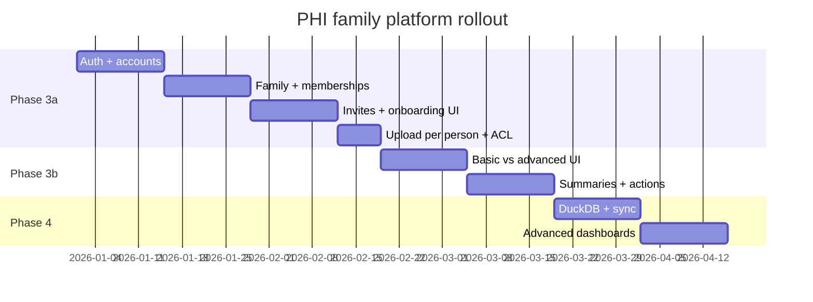

# Family, Auth & API Plan

Implementation blueprint for multi-member families, accounts, invites, and mode-aware APIs.

_Last updated: 2026-09-17_  
**Status:** Planned — not implemented

---

## Implementation phases



---

## New H2 tables (Flyway V4+)

### `families`

```sql
CREATE TABLE families (
    id                    VARCHAR(36) PRIMARY KEY,
    display_name          VARCHAR(255) NOT NULL,
    created_by_account_id VARCHAR(36) NOT NULL REFERENCES accounts(id),
    created_at            TIMESTAMP NOT NULL DEFAULT CURRENT_TIMESTAMP
);
-- Constraint: each account may create at most ONE family (app-level + unique index)
CREATE UNIQUE INDEX idx_families_one_per_creator ON families (created_by_account_id);
```

### `family_memberships`

```sql
CREATE TABLE family_memberships (
    id           VARCHAR(36) PRIMARY KEY,
    family_id    VARCHAR(36) NOT NULL REFERENCES families(id),
    person_id    BIGINT NOT NULL REFERENCES persons(id),
    relationship VARCHAR(32) NOT NULL,  -- enum: self, spouse, parent, child, sibling, other
    family_role  VARCHAR(16) NOT NULL DEFAULT 'member',  -- admin, maintainer, member
    joined_at    TIMESTAMP NOT NULL DEFAULT CURRENT_TIMESTAMP,
    left_at      TIMESTAMP,  -- soft leave; data retention per user delete setting
    UNIQUE (family_id, person_id)
);
-- A person may appear in MANY families (separate rows)
```

### Extend `persons`

```sql
ALTER TABLE persons ADD COLUMN date_of_birth DATE;
ALTER TABLE persons ADD COLUMN sex VARCHAR(16);
ALTER TABLE persons ADD COLUMN height_cm DECIMAL(5,1);
ALTER TABLE persons ADD COLUMN weight_kg DECIMAL(5,1);
ALTER TABLE persons ADD COLUMN notes VARCHAR(1024);
```

### `accounts`

```sql
CREATE TABLE accounts (
    id              VARCHAR(36) PRIMARY KEY,
    person_id       BIGINT NOT NULL UNIQUE REFERENCES persons(id),
    email           VARCHAR(255) NOT NULL UNIQUE,
    password_hash   VARCHAR(255) NOT NULL,
    device_id       VARCHAR(255),  -- enforce one phone per account
    ui_mode         VARCHAR(16) NOT NULL DEFAULT 'basic',
    created_at      TIMESTAMP NOT NULL DEFAULT CURRENT_TIMESTAMP,
    last_login_at   TIMESTAMP
);
-- v1 auth: email + password only (free, easy). Phone/social later.
-- Not every person has an account — dependents are profile-only.
```

### `invites`

```sql
CREATE TABLE invites (
    id              VARCHAR(36) PRIMARY KEY,
    family_id       VARCHAR(36) NOT NULL REFERENCES families(id),
    person_id       BIGINT NOT NULL REFERENCES persons(id),  -- pre-created profile
    code            VARCHAR(8) NOT NULL UNIQUE,
    created_by      VARCHAR(36) NOT NULL REFERENCES accounts(id),
    expires_at      TIMESTAMP NOT NULL,
    accepted_at     TIMESTAMP,
    created_at      TIMESTAMP NOT NULL DEFAULT CURRENT_TIMESTAMP
);
```

### Extend `lab_reports`

```sql
ALTER TABLE lab_reports ADD COLUMN family_id VARCHAR(36) REFERENCES families(id);
ALTER TABLE lab_reports ADD COLUMN uploaded_by_account_id VARCHAR(36);
ALTER TABLE lab_reports ADD COLUMN deleted_at TIMESTAMP;  -- soft delete wrong uploads
```

### `audit_events`

```sql
CREATE TABLE audit_events (
    id           VARCHAR(36) PRIMARY KEY,
    family_id    VARCHAR(36) REFERENCES families(id),
    actor_account_id VARCHAR(36) REFERENCES accounts(id),
    action       VARCHAR(64) NOT NULL,  -- e.g. REPORT_UPLOADED, REPORT_DELETED, MEMBER_INVITED
    target_type  VARCHAR(32),           -- person, report, invite
    target_id    VARCHAR(64),
    metadata     VARCHAR(2048),         -- JSON snippet
    created_at   TIMESTAMP NOT NULL DEFAULT CURRENT_TIMESTAMP
);
```

---

## Auth API (planned)

| Method | Path | Auth | Description |
|--------|------|------|-------------|
| POST | `/api/v1/auth/register` | Public | Create account + person + family |
| POST | `/api/v1/auth/login` | Public | Returns JWT |
| POST | `/api/v1/auth/logout` | Bearer | Invalidate session (if server-side) |
| GET | `/api/v1/auth/me` | Bearer | Account + person + family + ui_mode |
| PATCH | `/api/v1/auth/me/mode` | Bearer | Set `basic` or `advanced` |

### JWT claims (example)

```json
{
  "sub": "account-uuid",
  "personId": 1,
  "familyId": "family-uuid",
  "uiMode": "basic"
}
```

---

## Family API (planned)

| Method | Path | Mode | Description |
|--------|------|------|-------------|
| GET | `/api/v1/family` | Advanced | Family + all members |
| PATCH | `/api/v1/family` | Advanced | Rename family |
| POST | `/api/v1/family/members` | Advanced | Create person + optional invite |
| PATCH | `/api/v1/family/members/{personId}` | Admin/maintainer | Edit member profile |
| GET | `/api/v1/family/members/{personId}` | Advanced | Member detail |
| POST | `/api/v1/family/members/{personId}/leave` | Member | Leave family |
| DELETE | `/api/v1/family/members/me/data` | Member | Delete own data after leave |
| PATCH | `/api/v1/family/members/{personId}/role` | Admin | Set maintainer |

---

## Invite API (planned)

| Method | Path | Mode | Description |
|--------|------|------|-------------|
| POST | `/api/v1/invites` | Advanced | Create invite for existing person |
| POST | `/api/v1/invites/accept` | Public* | Body: `{ code, accountId? }` — join family |
| GET | `/api/v1/invites/{code}` | Public | Validate code (masked name preview) |

*Accept may require authenticated new user after register.

---

## Reports API (changes to existing)

| Method | Path | Change |
|--------|------|--------|
| POST | `/api/v1/reports` | Add optional `personId` (advanced only; default self) |
| GET | `/api/v1/reports` | List reports — basic: own only; advanced: `?personId=` |
| GET | `/api/v1/reports/{id}` | ACL: own report OR advanced + same family |
| DELETE | `/api/v1/reports/{id}` | Uploader or admin — soft delete wrong upload |
| GET | `/api/v1/family/feed` | Basic+ | “Mom’s report is ready” style events |

---

## Summary API (planned — Phase 3b)

| Method | Path | Mode | Description |
|--------|------|------|-------------|
| GET | `/api/v1/persons/me/summary` | Basic+ | Latest report plain-language summary |
| GET | `/api/v1/persons/me/actions` | Basic+ | Rule-based action items |
| GET | `/api/v1/persons/me/trends` | Basic+ | Simple trend (H2 or DuckDB) |

---

## Mobile navigation (planned)

### Basic mode tabs

1. **Home** — summary + actions + upload
2. **My trends** — own biomarkers over time (simple)
3. **Settings** — profile, switch to advanced

### Advanced mode tabs (additional)

1. **Family** — roster, invite, pick member, switch active family (if in 2+)
2. **Dashboards** — mobile + **web** for advanced users (DuckDB)
3. **Reports** — all members, full biomarker tables

Same app binary — `ui_mode` + **active `familyId`** in client state.

---

## Security rules (server-side)

```java
// Pseudocode — AccessControlService
boolean canReadReport(Account a, LabReport r) {
    if (r.personId == a.personId) return true;
    if (a.uiMode != ADVANCED) return false;
    return sameFamily(a, r.personId);
}

boolean canUploadFor(Account a, Long personId) {
    if (personId == a.personId) return true;
    if (a.uiMode != ADVANCED) return false;
    return sameFamily(a, personId);
}
```

Never rely on UI hiding alone — enforce on API.

---

## Migration from current single-person setup

1. `V4__families.sql` — new tables
2. Data migration: wrap existing `Ankit` person in a family; create default account manually or via script
3. Replace `findFirstByOrderByIdAsc()` with authenticated `personId`
4. Add Spring Security JWT filter; remove permissive `/api/v1/reports/**`
5. Mobile: add login/register screens before home

---

## Testing checklist

- [ ] Basic user cannot GET another member’s report (403)
- [ ] Advanced user can upload for parent (200)
- [ ] Invite code expires after 7 days
- [ ] Accept invite links account to correct person
- [ ] DuckDB sync runs after extraction (Phase 4)
- [ ] Analytics endpoints return 403 in basic mode

---

## Related docs

- [16-product-vision-family-and-modes.md](./16-product-vision-family-and-modes.md)
- [17-hybrid-data-architecture.md](./17-hybrid-data-architecture.md)
- [10-security.md](./10-security.md) — current open API (to be replaced)
