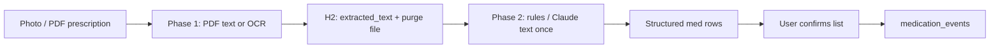

# Medication log & prescription ingest

How PHI tracks medications for correlation with lab trends — especially **chronic care** (diabetes, BP, thyroid) for older family members.

_Last updated: 2026-09-19_

---

## Who this is for

| Audience | Why medications matter |
|----------|------------------------|
| **Older adults on lifelong meds** | Primary users — HbA1c, lipids, creatinine trends must be read **in context** of metformin, statins, antihypertensives |
| **Acute illness courses** | Malaria, dengue, viral fever — short courses that temporarily affect liver/kidney markers |
| **Family maintainers** | Upload parent's prescription once; no typing ten drug names on a phone |

Manual one-by-one entry in Settings is a **fallback**, not the main path.

---

## Two course types

| Type | Examples | End date | Product behavior |
|------|----------|----------|------------------|
| **ACUTE** | Antimalarials, antibiotics, antivirals for fever | Known duration ("5 days", "1 week") | `expected_end_on` from start + duration; optional reminder when course ends |
| **CHRONIC** | Metformin, amlodipine, thyroxine | None until doctor changes | `ended_on` stays null; show as "ongoing" on home and trends |
| **UNKNOWN** | Extraction unsure | User confirms on review screen | Default after OCR/parse until confirmed |

**We never suggest dose changes.** Log and correlate only — same rule as lab findings.

---

## Primary flow: upload prescription (planned)

Same engineering pattern as lab reports:

### Fields extracted per line item

| Field | Example |
|-------|---------|
| `medication_name` | Metformin 500 mg |
| `dosage` | 1 tablet |
| `schedule_text` | 1-0-1 after food |
| `started_on` | From prescription date or user |
| `duration_days` | 5 (acute) or null (chronic) |
| `course_type` | ACUTE / CHRONIC / UNKNOWN |
| `source` | PRESCRIPTION |
| `source_report_id` | Link to ingest document |

### Reuse existing ingest stack

- Add `document_type` on ingest: `LAB_REPORT` | `PRESCRIPTION` (same upload endpoint, different parse path).
- Phase 1 local text + ephemeral file — **no long-term PDF storage**.
- Claude (if needed) parses **text from DB once** → JSON array; never per-user chat.
- **Review screen** before save (like report-date confirmation) — user can fix name, mark chronic vs acute.

### Why not manual-only

Prescriptions are already on paper or WhatsApp photos. Typing names punishes the people who need the app most.

---

## Correlation with biomarkers (Layer 2 — SQL)

Once `medication_events` and `biomarker_values` share timelines:

- "HbA1c rose 0.4% in the 90 days after metformin dose increase" — **SQL**, not Claude.
- "ALT elevated during 5-day antimalarial course" — overlay acute med window on LFT trend.
- Home insight cards can reference **active chronic meds** when explaining out-of-range values (template text).

---

## What we do not build

- Dosing advice or "take more/less"
- Medication reminders as a pill alarm app (optional gentle "course ending" later)
- Storing prescription PDFs long-term
- Sending full prescription history to Claude on every question

---

## Schema (`medication_events`)

| Column | Purpose |
|--------|---------|
| `course_type` | ACUTE \| CHRONIC \| UNKNOWN |
| `schedule_text` | Timings in doctor's words |
| `duration_days` | Acute course length |
| `expected_end_on` | Computed or extracted end |
| `source` | MANUAL \| PRESCRIPTION |
| `source_report_id` | FK to ingest document |

Migration: `V10__medication_course_and_schedule.sql`

---

## Implementation status

| Item | Status |
|------|--------|
| `medication_events` table + CRUD API | Done |
| Course type + schedule columns | Done (V10) |
| Manual add in Settings (fallback) | Done |
| Prescription upload + extraction | **Next** — Sprint 5e |
| Confirm-extracted-meds UI | Planned |
| Med ↔ biomarker SQL insights | Planned |
| Course-end reminders (acute) | Later |

---

## Related

- [00-engineering-principles.md](./00-engineering-principles.md)
- [07-extraction-pipeline.md](./07-extraction-pipeline.md)
- [19-product-decisions.md](./19-product-decisions.md) — Medications section
